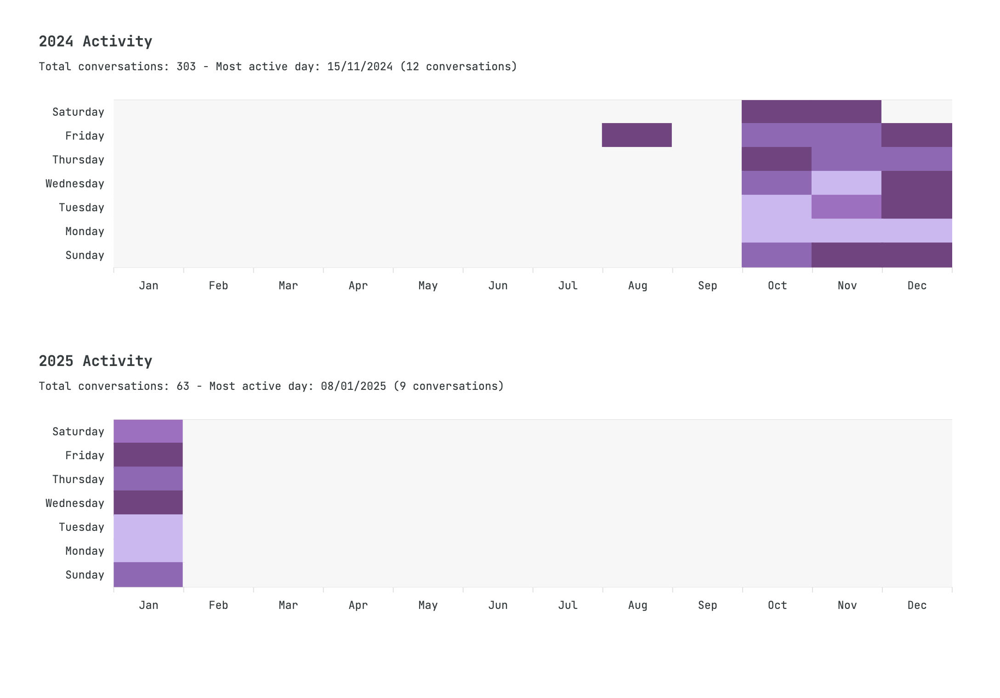

# ChatGPT & Claude Conversation Analyzer

A browser-based tool that transforms your AI chat history into beautiful visual heatmaps, inspired by Chip Huyen's Jupyter notebook implementation.

All your conversations are processed securely in your browser - no data ever leaves your device. Generate stunning visualizations of your chat patterns over time and save them as images.

## Try It Out

1. Export your chat data:
- ChatGPT: Settings > Data controls > Export
- Claude: Settings > Account > Export Data
2. Unzip the downloaded file
3. Drop your `conversations.json` in the app and watch your heatmap come to life

The heatmap reveals your AI chat patterns - perfect for understanding when and how often you engage with these tools. Save and share your visualization anytime.

[Original notebook reference](https://github.com/chiphuyen/aie-book/blob/main/scripts/ai-heatmap.ipynb)

## Sample Output
